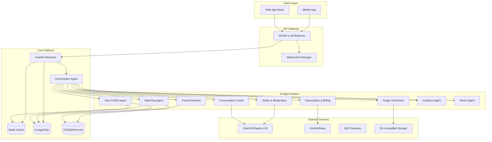
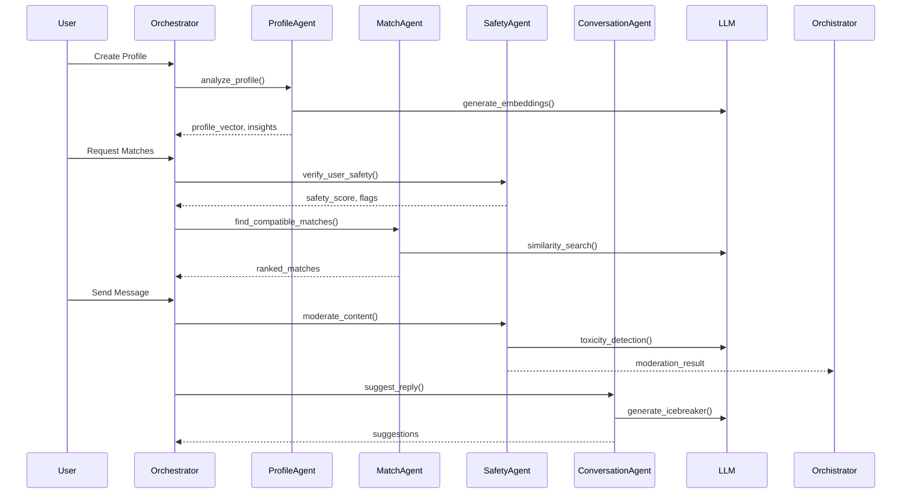
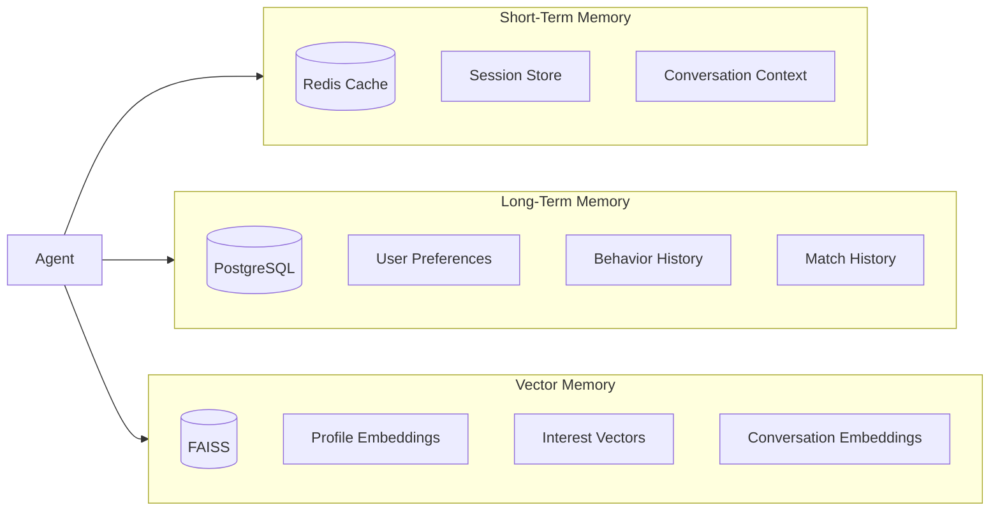
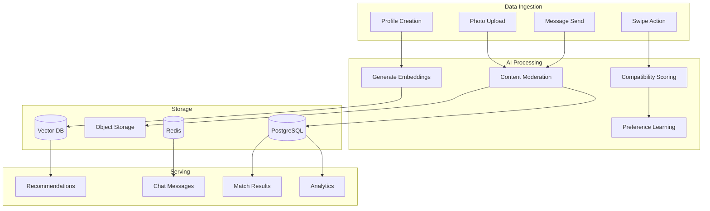
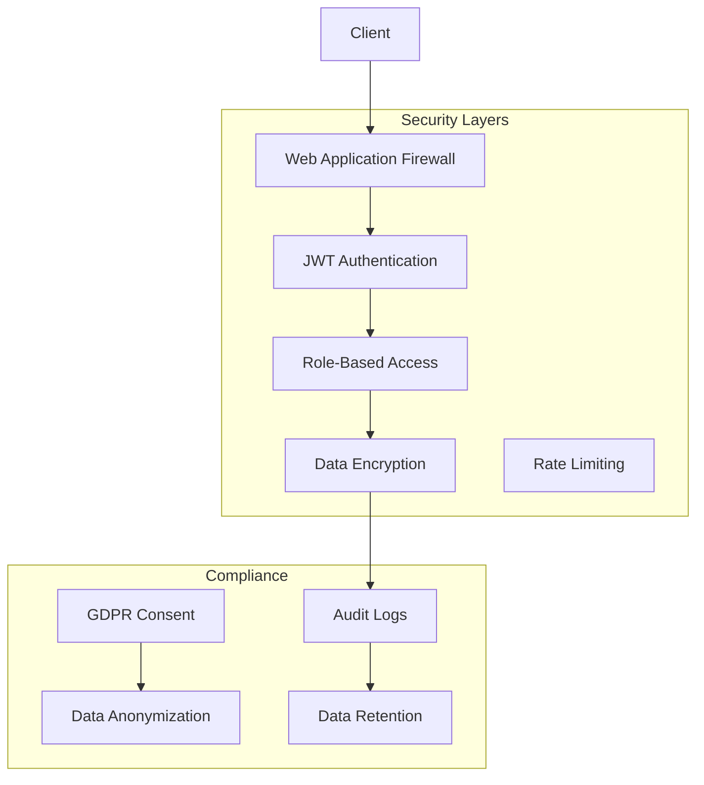
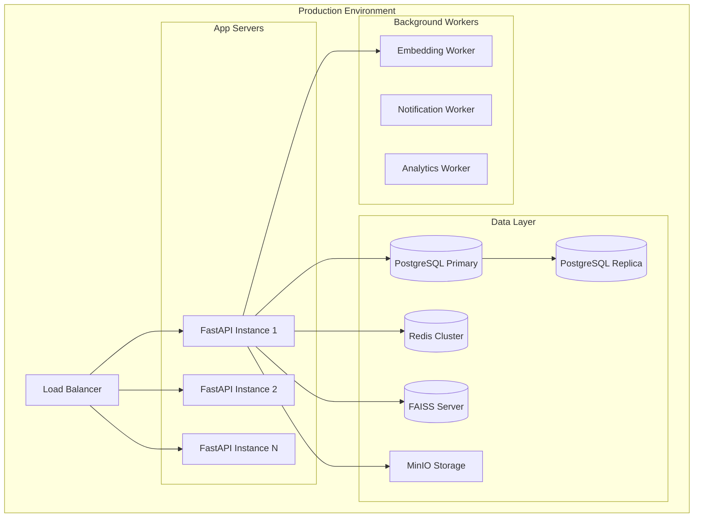
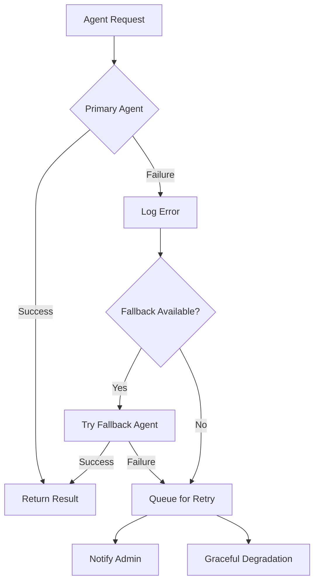

# Milan AI - Agentic Generative AI Dating Platform Architecture

## 🎯 Project Overview

**Milan AI** is a sophisticated, AI-powered online dating platform specifically designed for the Nepalese market. It employs a multi-agent architecture where autonomous AI agents collaborate to provide intelligent matchmaking, safety moderation, and personalized user experiences.

---

## 🧠 Multi-Agent Architecture

### System Architecture Diagram



### Agent Communication Flow



---

## 🤖 Agent Specifications

### 1. Orchestrator Agent
**Purpose**: Central coordinator for all agent interactions

```yaml
Responsibilities:
  - Route requests to appropriate agents
  - Manage agent lifecycle
  - Handle agent failures
  - Aggregate responses
  - Maintain conversation context

Input Schema:
  action: string
  user_id: uuid
  payload: object
  priority: enum[low, medium, high]

Output Schema:
  success: boolean
  agent_responses: array
  execution_time_ms: int
  error: string | null

Tools:
  - route_to_agent(agent_name, payload)
  - aggregate_responses(responses)
  - handle_failure(agent, error)
  - get_agent_status()
```

### 2. User Profile Agent
**Purpose**: Profile creation, analysis, and embedding generation

```yaml
Responsibilities:
  - Extract personality traits from profiles
  - Generate vector embeddings
  - Update preference learning
  - Profile completeness scoring

System Prompt: |
  You are a User Profile Analysis Agent. Your task is to:
  1. Analyze user profile text for personality indicators
  2. Extract interests, values, and preferences
  3. Generate structured profile metadata
  4. Identify potential red flags or inconsistencies
  
  Output JSON format only.

Tools:
  - generate_embedding(text): vector
  - extract_interests(profile): list
  - calculate_completeness(profile): score
  - detect_anomalies(profile): flags
```

### 3. Matching & Recommendation Agent
**Purpose**: Intelligent profile matching and ranking

```yaml
Responsibilities:
  - Vector similarity search
  - Collaborative filtering
  - Preference-based ranking
  - Cold-start handling

Algorithm:
  hybrid_score = 0.4 * vector_similarity + 
                 0.3 * preference_match + 
                 0.2 * behavioral_score + 
                 0.1 * diversity_bonus

Tools:
  - vector_search(user_vector, k=50): matches
  - calculate_compatibility(u1, u2): score
  - rank_candidates(candidates, user_prefs): ranked_list
  - explain_match(user, match): reasoning
```

### 4. Conversation Coach Agent
**Purpose**: Improve conversation quality and engagement

```yaml
Responsibilities:
  - Generate icebreakers
  - Suggest conversation topics
  - Analyze conversation sentiment
  - Detect conversation stagnation

System Prompt: |
  You are a Conversation Coach for a dating app. 
  Generate natural, culturally appropriate conversation 
  starters and replies for Nepalese users.
  
  Consider:
  - Nepalese cultural context
  - User interests and profile
  - Conversation history
  - Tone appropriateness

Tools:
  - generate_icebreaker(user, match): suggestions
  - analyze_conversation(messages): insights
  - suggest_reply(context): options
  - detect_stagnation(conversation): boolean
```

### 5. Safety & Moderation Agent
**Purpose**: Content moderation and user safety

```yaml
Responsibilities:
  - Toxicity detection
  - Harassment prevention
  - Content flagging
  - Emergency escalation

Categories to Detect:
  - Hate speech
  - Sexual harassment
  - Scam attempts
  - Personal information sharing
  - Threats or violence

Tools:
  - moderate_text(text): {safe: bool, flags: []}
  - analyze_image(image): {safe: bool, flags: []}
  - escalate_to_human(report): ticket_id
  - ban_user(user_id, reason): success
```

### 6. Fraud Detection Agent
**Purpose**: Detect fake accounts and scam attempts

```yaml
Responsibilities:
  - Behavioral anomaly detection
  - Pattern analysis
  - Device fingerprinting
  - Account authenticity scoring

Red Flags:
  - Multiple accounts from same device
  - Rapid messaging patterns
  - Suspicious photo sources
  - Inconsistent profile information
  - External link sharing

Tools:
  - analyze_behavior(user): risk_score
  - detect_fake_profile(profile): probability
  - flag_suspicious_activity(activity): alert
  - verify_identity_documents(doc): result
```

### 7. Image Verification Agent
**Purpose**: Photo verification and moderation

```yaml
Responsibilities:
  - Face detection and verification
  - Inappropriate content detection
  - Photo authenticity check
  - Verification badge issuance

Checks:
  - Face presence and clarity
  - Multiple faces detection
  - NSFW content
  - Stock photo detection
  - Face matching for verification selfies

Tools:
  - detect_faces(image): faces[]
  - verify_selfie(user_photo, selfie): match
  - detect_nsfw(image): safety_score
  - check_authenticity(image): authenticity_score
```

### 8. Subscription & Billing Agent
**Purpose**: Handle payments and subscriptions in NPR

```yaml
Responsibilities:
  - Process payments (Khalti/eSewa)
  - Manage subscription tiers
  - Handle billing cycles
  - Payment failure recovery

Subscription Tiers:
  Free: Rs. 0
  Basic: Rs. 499/month
  Premium: Rs. 999/month
  Elite: Rs. 1999/month

Tools:
  - process_payment(user, amount, method): result
  - upgrade_subscription(user, tier): success
  - calculate_proration(user, new_tier): amount
  - handle_failed_payment(payment): action
```

### 9. Analytics & Learning Agent
**Purpose**: Platform analytics and model improvement

```yaml
Responsibilities:
  - Track match success rates
  - Analyze user behavior
  - A/B test recommendations
  - Model performance monitoring

Metrics:
  - Match rate
  - Conversation initiation rate
  - Response rate
  - Date conversion rate
  - User retention
  - Revenue per user

Tools:
  - track_event(event, metadata): void
  - generate_report(period): report
  - analyze_funnel(steps): conversion_rates
  - recommend_improvements(): suggestions
```

### 10. Admin Agent
**Purpose**: Administrative operations and support

```yaml
Responsibilities:
  - User management
  - Report handling
  - Content moderation queue
  - System health monitoring

Tools:
  - get_user_details(user_id): profile
  - suspend_user(user_id, duration): success
  - resolve_report(report_id): success
  - get_system_metrics(): metrics
  - broadcast_message(message): sent_count
```

---

## 💾 Memory System Architecture



### Memory Types

| Type | Storage | TTL | Use Case |
|------|---------|-----|----------|
| Session | Redis | 24h | Active user sessions |
| Conversation Context | Redis | 1h | Active chat context |
| User Preferences | PostgreSQL | Permanent | Learned preferences |
| Profile Embeddings | FAISS | Updated nightly | Similarity search |
| Behavioral Patterns | PostgreSQL | 90 days | Fraud detection |

---

## 🔧 Technology Stack Justification

| Component | Technology | Justification |
|-----------|-----------|---------------|
| **Frontend** | React + Next.js | SSR for SEO, excellent ecosystem, TypeScript support |
| **Backend** | Python FastAPI | Async support, automatic API docs, Pydantic validation |
| **Database** | PostgreSQL | ACID compliance, JSON support, geospatial queries |
| **Vector DB** | FAISS | Efficient similarity search, open-source, scales well |
| **Cache** | Redis | Sub-millisecond latency, pub/sub for real-time features |
| **WebSockets** | Socket.io | Real-time chat, fallback support |
| **Storage** | MinIO (S3-compatible) | Object storage for images/videos |
| **Message Queue** | Redis/RQ | Background job processing |
| **Container** | Docker + Compose | Easy deployment, environment consistency |
| **LLM** | OpenAI GPT-4 / Claude | Best-in-class reasoning, JSON mode support |

---

## 📊 Data Flow Architecture



---

## 🔒 Security Architecture



---

## 📈 Scalability Considerations

### Horizontal Scaling
- Stateless FastAPI instances behind load balancer
- Redis Cluster for session/cache distribution
- PostgreSQL read replicas for query scaling
- FAISS sharding for vector search

### Performance Optimizations
- CDN for static assets and images
- Connection pooling for database
- Async operations for I/O bound tasks
- Batch processing for embeddings
- Caching for frequent queries

### Cost Optimization
- Tiered storage (hot/warm/cold data)
- Intelligent caching strategies
- Lazy loading for non-critical features
- Background job processing during off-peak

---

## 🚀 Deployment Architecture



---

## 📋 Agent Failure Handling



### Failure Recovery Strategies

| Agent | Primary | Fallback | Degradation |
|-------|---------|----------|-------------|
| Matching | Vector Search | Rule-based | Popular profiles |
| Conversation | LLM | Template replies | No suggestions |
| Safety | LLM | Keyword filter | Manual review |
| Image | ML Model | Basic checks | Manual approval |

---

## 🎯 Success Metrics

### User Engagement
- Daily Active Users (DAU)
- Session duration
- Profiles viewed per session
- Matches per user per week

### Match Quality
- Message response rate
- Conversation length
- Date conversion rate
- User-reported satisfaction

### Platform Health
- Fake account detection rate
- Content moderation accuracy
- System uptime (99.9%)
- API response time (<200ms p95)

### Business Metrics
- Conversion rate (Free → Paid)
- Monthly Recurring Revenue (MRR)
- Customer Acquisition Cost (CAC)
- Lifetime Value (LTV)
